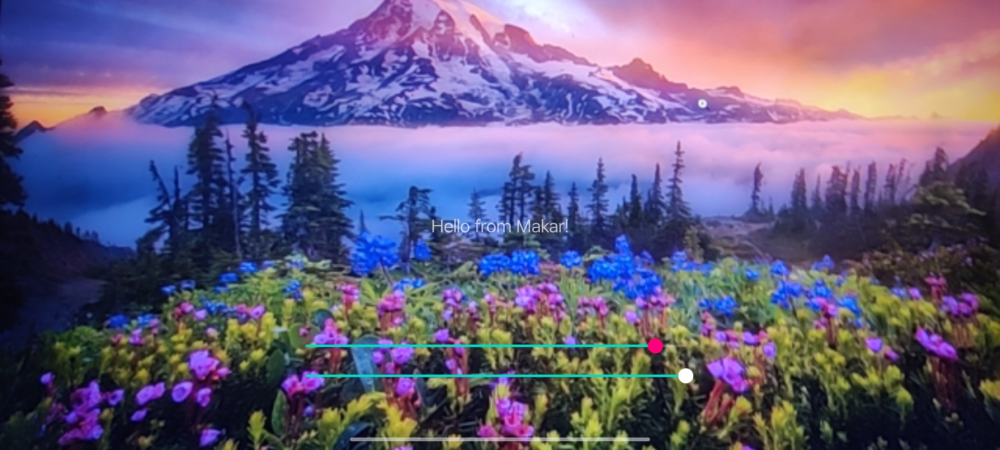
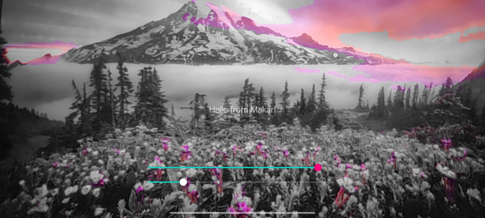
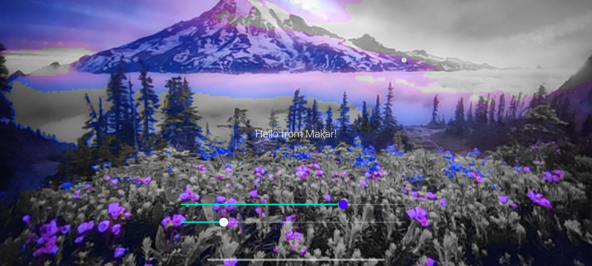
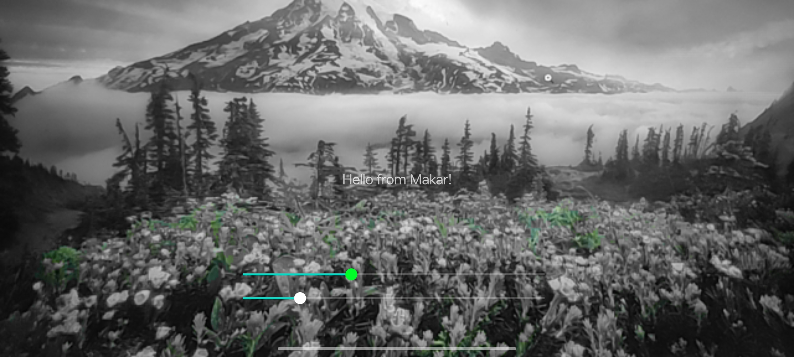
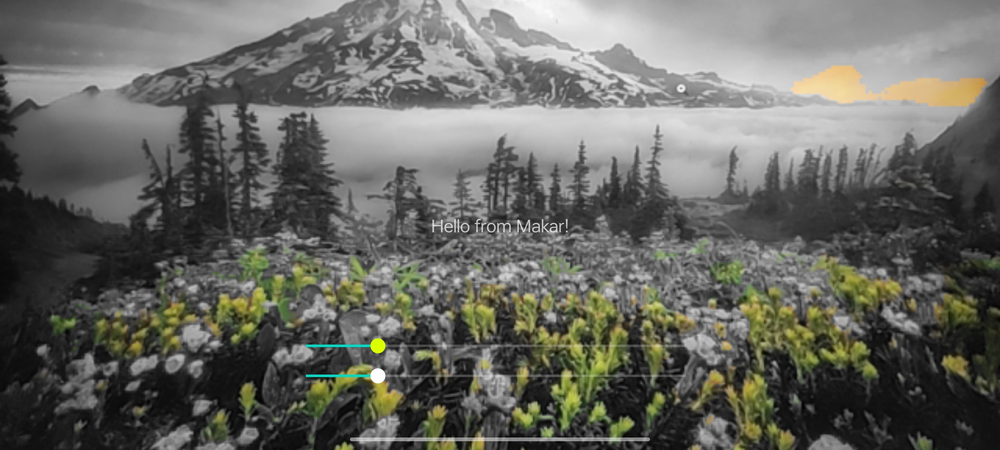
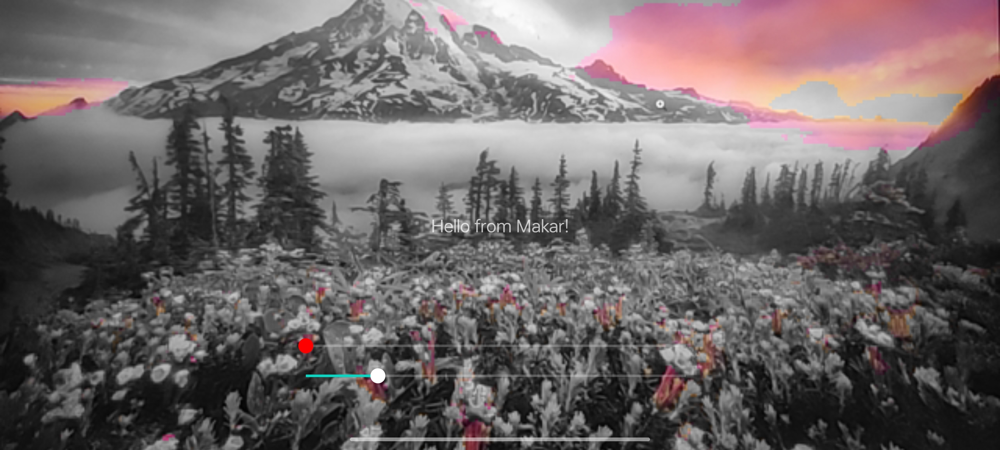

# FilterRGB
FilterRGB allows users to display a specific range of colors in the image.
# Apk To Download: [FilterRGB.apk](https://github.com/MakarPronin/FilterRGB/raw/main/Screenshots_And_Apk/FilterRGB.apk)
# Screenshots:
 

